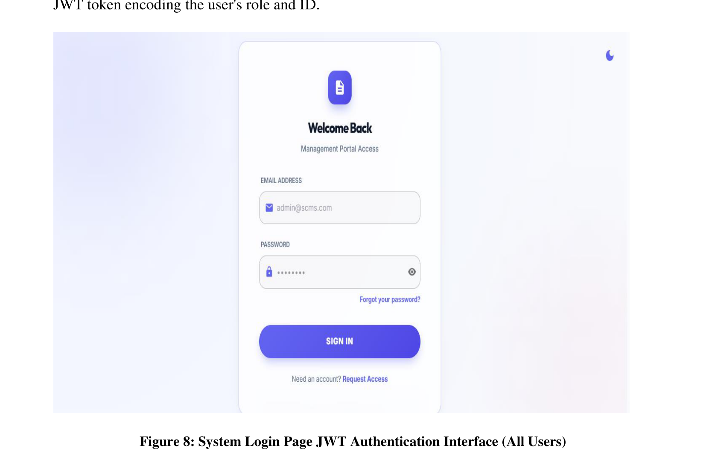
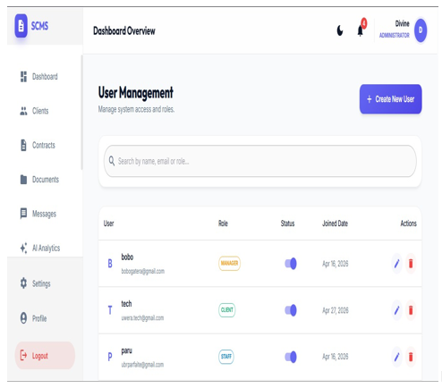
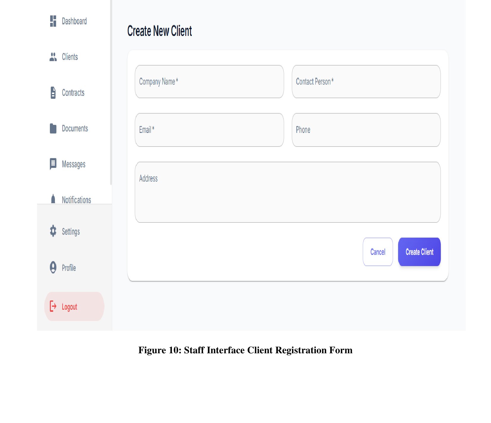
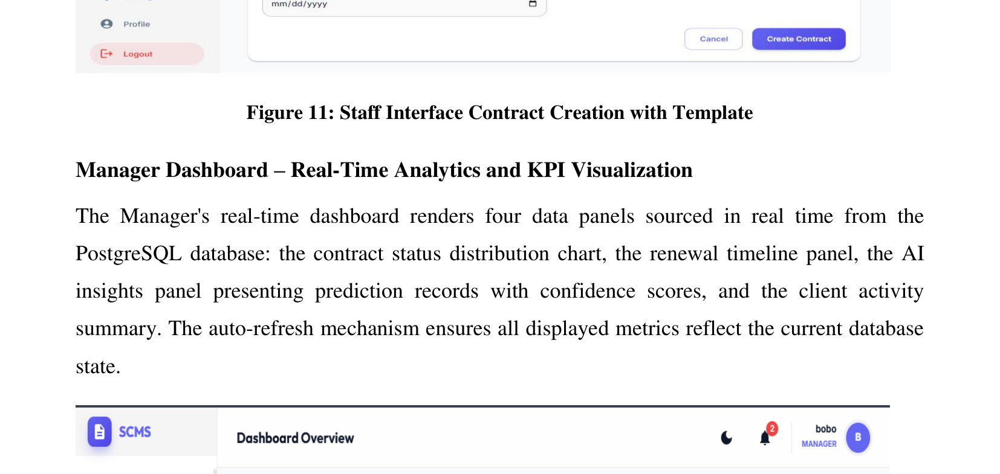
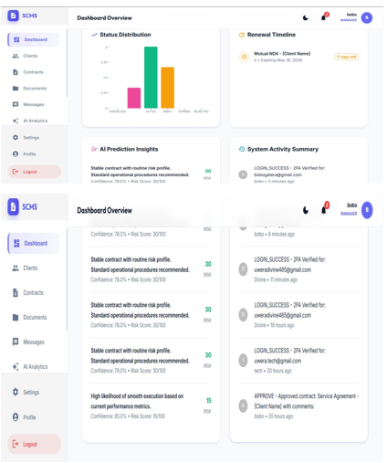
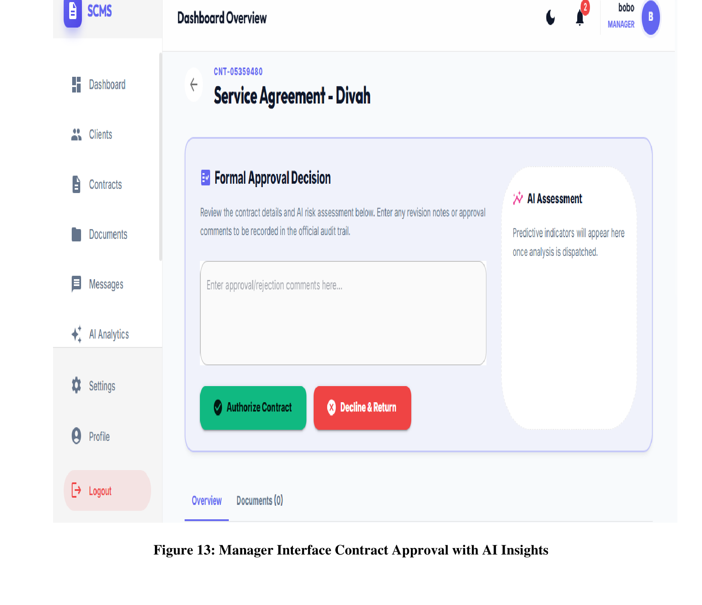
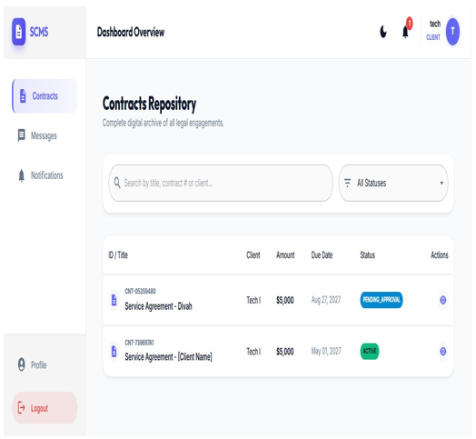
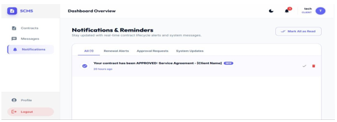
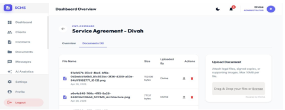
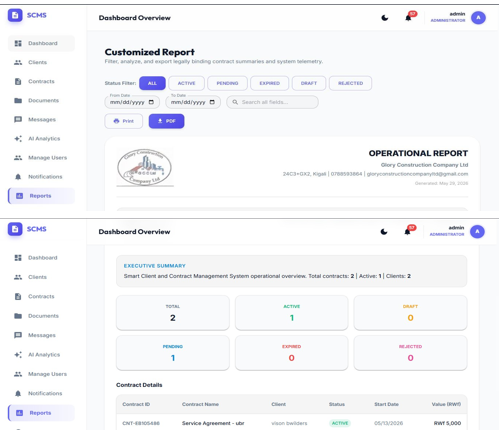

# SCMS — Smart Client & Contract Management System


A full-stack enterprise web application for managing clients, contracts, documents, and real-time communications — built for **Glory Construction Company Ltd (GCC Ltd)**, Kigali, Rwanda.

---

## Screenshots

### Login Page — JWT Authentication


### Administrator Dashboard — User Management


### Staff Interface — Client Registration Form


### Staff Interface — Contract Creation with Template


### Manager Dashboard — Real-Time Analytics & KPI Visualization


### Manager Interface — Contract Approval with AI Insights


### Client Portal — Contract Status Tracking


### Notifications & Reminders


### Document Upload & Management Module


### Reports Page — Customized Operational Reports


---

## Features

### Authentication & Authorization
- JWT-based login and session management
- Role-based access control: **Admin**, **Manager**, **Staff**, and **Client**
- Each role sees a tailored dashboard with scoped permissions

### Contract Lifecycle Management
Contracts move through a fully defined workflow:

```
DRAFT → SUBMITTED → APPROVED → ACTIVE → EXPIRING → EXPIRED
```

- Status transitions enforced server-side with business logic validation
- Visual lifecycle timeline on the contract detail page
- Automated expiry detection and status updates

### Real-Time Notifications
- WebSocket integration for live contract status updates
- Instant in-app notifications pushed to connected users on key events

### Document Management
- Secure file uploads integrated with **Cloudinary**
- Documents attached to contracts with version tracking
- Role-restricted access to sensitive files

### AI Analytics Module
- Predictive analytics on contract renewal likelihood
- Automated risk scoring and flagging for at-risk contracts
- Insights dashboard visible to Admin and Manager roles

### Audit Logging
- Every user action is logged with timestamp, actor, and affected entity
- Full audit trail viewable by Admins for compliance and accountability

### Reports
- Customizable contract reports filtered by status and date range
- Export to PDF with official GCC Ltd branding and signature lines

---

## Tech Stack

| Layer | Technology |
|---|---|
| Backend Language | Java 17 |
| Backend Framework | Spring Boot 3.2 |
| API Style | RESTful (Spring MVC) |
| Auth | JWT + Spring Security |
| ORM | Hibernate / JPA |
| Database | PostgreSQL 14 |
| Real-Time | WebSocket (STOMP) |
| File Storage | Cloudinary |
| Build Tool | Maven |
| API Docs | OpenAPI / Swagger |
| Frontend Framework | React 18 |
| Build Tool | Vite |
| State Management | Redux Toolkit |
| UI Library | Material UI (MUI) |
| HTTP Client | Axios |
| Containerization | Docker |

---

## Project Structure

```
scms/
├── backend/                  # Spring Boot REST API
│   └── src/main/java/com/scms/
│       ├── auth/             # JWT auth & security config
│       ├── controller/       # REST API controllers
│       ├── service/          # Business logic layer
│       ├── repository/       # JPA repositories
│       ├── dto/              # Request/Response DTOs
│       └── config/           # App configuration
│
└── frontend/                 # React + Vite SPA
    └── src/
        ├── pages/            # Route-level page components
        │   ├── auth/         # Login, Register, Reset Password
        │   ├── dashboard/    # Admin, Manager, Staff, Client dashboards
        │   ├── contracts/    # Contract CRUD & lifecycle
        │   ├── clients/      # Client management
        │   ├── documents/    # Document upload & retrieval
        │   ├── messages/     # Communication module
        │   ├── notifications/# Real-time alerts
        │   ├── ai/           # AI analytics
        │   └── admin/        # Audit logs & reports
        ├── components/       # Shared UI components
        └── App.jsx
```

---

## Getting Started

### Prerequisites
- Java 17+
- Maven 3.8+
- Node.js 18+
- PostgreSQL 14+
- A [Cloudinary](https://cloudinary.com/) account (free tier works)

### 1. Clone the Repository

```bash
git clone https://github.com/uweradivi/scms.git
cd scms
```

### 2. Backend Setup

```bash
cd backend
createdb scms_db
cp .env.example .env
# Fill in your values in .env
./mvnw spring-boot:run
```

Backend runs at: `http://localhost:8081`  
Swagger UI: `http://localhost:8081/swagger-ui.html`

### 3. Frontend Setup

```bash
cd frontend
npm install
cp .env.example .env
npm run dev
```

Frontend runs at: `http://localhost:5173`

---

## Environment Variables

### Backend (`backend/.env`)
```env
DB_URL=jdbc:postgresql://localhost:5432/scms_db
DB_USERNAME=your_db_user
DB_PASSWORD=your_db_password
JWT_SECRET=your_jwt_secret_key
CLOUDINARY_CLOUD_NAME=your_cloud_name
CLOUDINARY_API_KEY=your_api_key
CLOUDINARY_API_SECRET=your_api_secret
```

### Frontend (`frontend/.env`)
```env
VITE_API_BASE_URL=http://localhost:8081/api
VITE_WS_URL=ws://localhost:8081/ws
```

> ⚠️ Never commit `.env` files with real credentials.

---

## Role Permissions

| Feature | Admin | Manager | Staff | Client |
|---|:---:|:---:|:---:|:---:|
| View contracts | ✅ | ✅ | ✅ | ✅ (own only) |
| Create contracts | ✅ | ✅ | ✅ | ❌ |
| Approve contracts | ✅ | ✅ | ❌ | ❌ |
| Upload documents | ✅ | ✅ | ✅ | ❌ |
| View audit logs | ✅ | ❌ | ❌ | ❌ |
| View AI analytics | ✅ | ✅ | ❌ | ❌ |
| Manage users | ✅ | ❌ | ❌ | ❌ |
| Generate reports | ✅ | ✅ | ❌ | ❌ |

---

## Author

**Divine Uwera**  
Software Engineering Student — Adventist University of Central Africa (AUCA), Kigali  
📧 uweradivine485@gmail.com  
🐙 [github.com/uweradivi](https://github.com/uweradivi)

---

## License

This project was developed as a Final Year Project at AUCA for academic and portfolio purposes.

